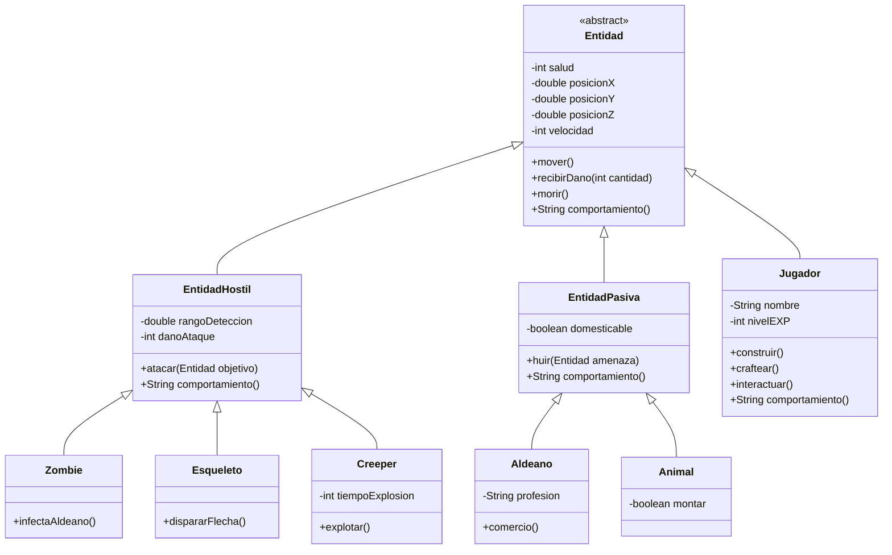

# msferreira-tplp3-2026

## Diagrama de clases

```mermaid
classDiagram
    direction TB

    class Entidad {
        <<abstract>>
        -int salud
        -double posicionX
        -double posicionY
        -double posicionZ
        -int velocidad
        +mover()
        +recibirDano(int cantidad)
        +morir()
        +String comportamiento()
    }

    class EntidadHostil {
        -double rangoDeteccion
        -int danoAtaque
        +atacar(Entidad objetivo)
        +String comportamiento()
    }

    class EntidadPasiva {
        -boolean domesticable
        +huir(Entidad amenaza)
        +String comportamiento()
    }

    class Jugador {
        -String nombre
        -int nivelEXP
        +construir()
        +craftear()
        +interactuar()
        +String comportamiento()
    }

    class Zombie {
        +infectaAldeano()
    }

    class Esqueleto {
        +dispararFlecha()
    }

    class Creeper {
        -int tiempoExplosion
        +explotar()
    }

    class Aldeano {
        -String profesion
        +comercio()
    }

    class Animal {
        -boolean montar
    }

    Entidad <|-- EntidadHostil
    Entidad <|-- EntidadPasiva
    Entidad <|-- Jugador

    EntidadHostil <|-- Zombie
    EntidadHostil <|-- Esqueleto
    EntidadHostil <|-- Creeper

    EntidadPasiva <|-- Aldeano
    EntidadPasiva <|-- Animal
```