# Minecraft - POO-06

Proyecto de Programación Orientada a Objetos desarrollado con Java 21 y Spring Boot. El dominio elegido es Minecraft y se utiliza para demostrar encapsulación, invariantes, herencia, abstracción, polimorfismo, sobrecarga y sobreescritura mediante una API REST observable.

## Objetivo

Modelar distintos tipos de entidades de Minecraft con reglas de dominio protegidas y exponer parte de su comportamiento mediante endpoints HTTP que devuelven JSON. El proyecto también incluye pruebas unitarias y de integración para verificar los conceptos de POO, las validaciones y los códigos HTTP.

## Dominio

El dominio elegido es Minecraft. La jerarquía representa entidades hostiles, entidades pasivas, jugadores y especializaciones reconocibles del juego.

## Tecnologías y requisitos

- JDK 21.
- Spring Boot 4.1.1.
- Spring Web MVC.
- Maven Wrapper incluido en el repositorio.
- No es necesario instalar Maven globalmente.

Para comprobar las versiones disponibles:

```bash
java -version
cd minecraft
./mvnw --version
```

## Ejecución

Desde la raíz del repositorio:

```bash
cd minecraft
./mvnw spring-boot:run
```

La aplicación queda disponible en `http://localhost:8080`.

## Pruebas

Desde la raíz del repositorio:

```bash
cd minecraft
./mvnw clean test
```

El estado documentado contiene 21 pruebas automatizadas: 1 prueba de contexto, 6 pruebas de dominio y 14 ejecuciones de integración con MockMvc.

## API REST

### GET /

Comprueba que la API está funcionando.

```bash
curl -i "http://localhost:8080/"
```

Respuesta esperada, con estado `200 OK`:

```json
{
  "estado": "API funcionando",
  "dominio": "Minecraft",
  "autora": "María Sol Ferreira"
}
```

### GET /entidad

Construye temporalmente un `Creeper` o un `Aldeano` a partir de parámetros de la URL. El controlador mantiene la referencia con el tipo padre `Entidad` e invoca `comportamiento()` polimórficamente.

| Parámetro | Obligatorio | Valor predeterminado | Regla |
|---|---|---|---|
| `tipo` | Sí | Sin valor | `creeper` o `aldeano`, sin distinguir mayúsculas. |
| `salud` | Sí | Sin valor | Entero mayor que 0. |
| `x` | No | `0` | Número finito. |
| `y` | No | `0` | Número finito. |
| `z` | No | `0` | Número finito. |
| `velocidad` | No | `1` | Entero mayor o igual que 0. |
| `rango` | No | `10` | Para Creeper: número finito mayor o igual que 0. |
| `dano` | No | `5` | Para Creeper: entero mayor que 0. |
| `tiempoExplosion` | No | `3` | Para Creeper: entero mayor que 0. |
| `profesion` | No | `Granjero` | Para Aldeano: texto no vacío ni compuesto solo por espacios. |

#### Creeper válido

```bash
curl -i "http://localhost:8080/entidad?tipo=creeper&salud=20&x=1&y=2&z=3&velocidad=4&rango=10&dano=5&tiempoExplosion=3"
```

```json
{
  "tipo": "Creeper",
  "comportamiento": "La entidad hostil ataca."
}
```

#### Aldeano válido

```bash
curl -i "http://localhost:8080/entidad?tipo=aldeano&salud=20&profesion=Herrero"
```

```json
{
  "tipo": "Aldeano",
  "comportamiento": "La entidad pasiva huye."
}
```

#### Tipo inválido

```bash
curl -i "http://localhost:8080/entidad?tipo=zombie&salud=20"
```

Respuesta esperada, con estado `400 Bad Request`:

```json
{
  "error": "Entrada inválida",
  "mensaje": "Tipo válido: creeper o aldeano"
}
```

#### Estado de dominio inválido

```bash
curl -i "http://localhost:8080/entidad?tipo=creeper&salud=0"
curl -i "http://localhost:8080/entidad?tipo=creeper&salud=20&x=NaN"
curl -i "http://localhost:8080/entidad?tipo=creeper&salud=20&dano=0"
```

Los tres casos devuelven `400 Bad Request`. Los parámetros requeridos ausentes y los valores numéricos con formato inválido también son rechazados con 400 por Spring MVC.

### Códigos HTTP

| Código | Significado en esta API |
|---|---|
| `200 OK` | Solicitud válida y respuesta JSON generada. |
| `400 Bad Request` | Tipo desconocido, parámetro ausente o mal formado, o incumplimiento de una invariante del dominio. |
| `500 Internal Server Error` | Error interno inesperado; no se utiliza para representar errores conocidos de entrada. |

## Estructura de paquetes

```text
py.edu.uc.lp3.msferreira.minecraft
├── MinecraftApplication.java
├── domain
│   ├── Entidad.java
│   ├── EntidadHostil.java
│   ├── EntidadPasiva.java
│   ├── Jugador.java
│   ├── Zombie.java
│   ├── Creeper.java
│   ├── Esqueleto.java
│   ├── Aldeano.java
│   └── Animal.java
└── rest
    └── controller
        ├── IndexController.java
        └── EntidadController.java
```

`MinecraftApplication` permanece en el paquete raíz para que Spring descubra los controladores de los subpaquetes. El modelo de dominio está separado de la capa HTTP.

## Encapsulación e invariantes

Los atributos del dominio son privados y no pueden modificarse directamente desde otras clases. `getSalud()` permite consultar la salud, pero no cambiarla.

Las reglas principales son:

- La salud inicial debe ser mayor que 0.
- La velocidad no puede ser negativa.
- Las coordenadas deben ser finitas; no se admiten `NaN` ni infinitos.
- El rango debe ser finito y no negativo.
- El daño y el tiempo de explosión deben ser mayores que 0.
- El nombre y la profesión no pueden ser nulos ni estar en blanco.
- La experiencia no puede ser negativa.
- Un objetivo de ataque no puede ser nulo.
- Un ataque con distancia exige una distancia finita, no negativa y dentro del rango.
- `recibirDano` usa `Math.max(0, salud - cantidad)`, por lo que la salud nunca queda por debajo de 0.

Las validaciones están en los constructores y métodos del dominio, no en los controladores.

## Herencia y abstracción

`Entidad` es la clase base abstracta y declara el método abstracto `comportamiento()`. Las relaciones principales son:

- `EntidadHostil`, `EntidadPasiva` y `Jugador` son entidades.
- `Creeper`, `Zombie` y `Esqueleto` son entidades hostiles.
- `Aldeano` y `Animal` son entidades pasivas.

## Polimorfismo

`EntidadController` declara una referencia de tipo `Entidad` y le asigna un `Creeper` o un `Aldeano`. La llamada `entidad.comportamiento()` selecciona en ejecución la implementación hostil o pasiva correspondiente.

Las pruebas también utilizan referencias `Entidad` para verificar respuestas distintas sin depender del tipo concreto.

## Sobrecarga

La sobrecarga ocurre cuando una clase declara métodos o constructores con el mismo nombre y distinta lista de parámetros.

Se aplica en:

- `Creeper`: constructor de siete parámetros y constructor de ocho parámetros. El primero utiliza `this(...)` y establece un tiempo de explosión predeterminado de 3 segundos.
- `EntidadHostil`: `atacar(Entidad objetivo)` y `atacar(Entidad objetivo, double distancia)`.

La variante con distancia comprueba el rango y luego delega el ataque en la variante de un argumento.

## Sobreescritura

La sobreescritura ocurre cuando una clase hija proporciona una implementación propia de un método heredado conservando la misma firma.

`Entidad` declara `comportamiento()` como abstracto y las siguientes clases lo implementan con `@Override`:

- `EntidadHostil`: devuelve el comportamiento de ataque.
- `EntidadPasiva`: devuelve el comportamiento de huida.
- `Jugador`: devuelve el comportamiento de interacción con el mundo.

### Diferencia entre sobrecarga y sobreescritura

| Concepto | Sobrecarga | Sobreescritura |
|---|---|---|
| Ubicación | Normalmente en la misma clase. | Entre una clase padre y una hija. |
| Firma | Mismo nombre y distintos parámetros. | Misma firma. |
| Selección | Se resuelve según los argumentos de la llamada. | Se resuelve según el tipo real del objeto. |
| Ejemplo | Los dos constructores de `Creeper` y los dos métodos `atacar`. | Las implementaciones de `comportamiento()`. |

## Diagrama de clases

```mermaid
classDiagram
    direction TB

    class Entidad {
        <<abstract>>
        -int salud
        -double posicionX
        -double posicionY
        -double posicionZ
        -int velocidad
        +Entidad(int salud, double posicionX, double posicionY, double posicionZ, int velocidad)
        +int getSalud()
        +void mover()
        +void recibirDano(int cantidad)
        +void morir()
        +String comportamiento()*
    }

    class EntidadHostil {
        -double rangoDeteccion
        -int danoAtaque
        +EntidadHostil(int salud, double posicionX, double posicionY, double posicionZ, int velocidad, double rangoDeteccion, int danoAtaque)
        +void atacar(Entidad objetivo)
        +void atacar(Entidad objetivo, double distancia)
        +String comportamiento()
    }

    class EntidadPasiva {
        -boolean domesticable
        +EntidadPasiva(int salud, double posicionX, double posicionY, double posicionZ, int velocidad, boolean domesticable)
        +void huir(Entidad amenaza)
        +String comportamiento()
    }

    class Jugador {
        -String nombre
        -int nivelEXP
        +Jugador(String nombre, int nivelEXP, int salud, double posicionX, double posicionY, double posicionZ, int velocidad)
        +void construir()
        +void craftear()
        +void interactuar()
        +String comportamiento()
    }

    class Zombie {
        +Zombie(int salud, double posicionX, double posicionY, double posicionZ, int velocidad, double rangoDeteccion, int danoAtaque)
        +void infectarAldeano()
    }

    class Esqueleto {
        +Esqueleto(int salud, double posicionX, double posicionY, double posicionZ, int velocidad, double rangoDeteccion, int danoAtaque)
        +void dispararFlecha()
    }

    class Creeper {
        -int tiempoExplosion
        +Creeper(int salud, double posicionX, double posicionY, double posicionZ, int velocidad, double rangoDeteccion, int danoAtaque)
        +Creeper(int salud, double posicionX, double posicionY, double posicionZ, int velocidad, double rangoDeteccion, int danoAtaque, int tiempoExplosion)
        +void explotar()
    }

    class Aldeano {
        -String profesion
        +Aldeano(int salud, double posicionX, double posicionY, double posicionZ, int velocidad, boolean domesticable, String profesion)
        +void comercio()
    }

    class Animal {
        -boolean montar
        +Animal(int salud, double posicionX, double posicionY, double posicionZ, int velocidad, boolean domesticable, boolean montar)
    }

    Entidad <|-- EntidadHostil
    Entidad <|-- EntidadPasiva
    Entidad <|-- Jugador
    EntidadHostil <|-- Zombie
    EntidadHostil <|-- Esqueleto
    EntidadHostil <|-- Creeper
    EntidadPasiva <|-- Aldeano
    EntidadPasiva <|-- Animal
```



## Licencia

Este proyecto se distribuye bajo la [Apache License 2.0](LICENSE).

## Uso de inteligencia artificial

El registro de herramientas, modelo, prompts resumidos y tareas asistidas está disponible en [BITACORA.md](BITACORA.md).

La especificación resumida para Classroom está disponible en [ESPECIFICACION-POO06.md](ESPECIFICACION-POO06.md).

## Enlace al commit de entrega

El enlace exacto al commit de entrega se proporcionará en Classroom después de realizar el último commit y push. No se incluye aquí un SHA autorreferencial porque cualquier modificación posterior de este archivo produciría un commit diferente.
