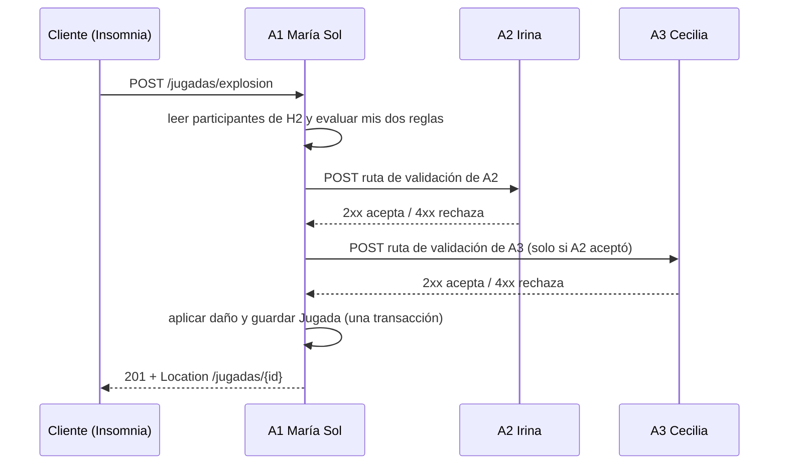
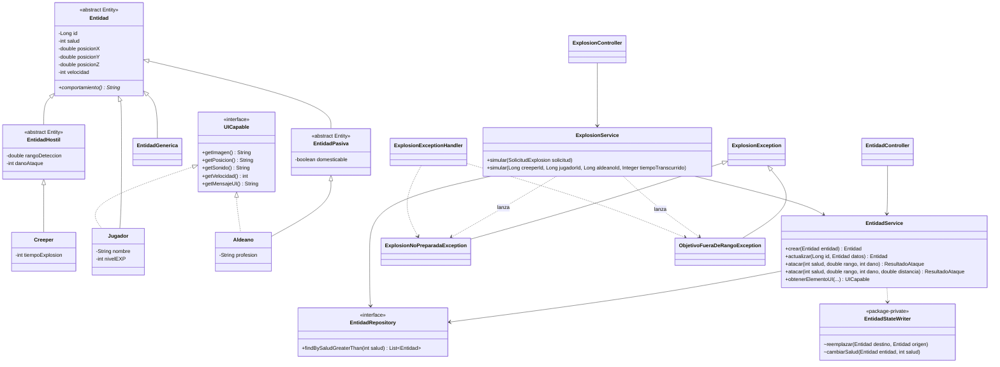

# Minecraft - POO-09 (APIs cruzadas) sobre POO-08

Servicio HTTP de LP3 desarrollado con Java 21, Spring Boot, JPA y H2. Conserva la jerarquía, el polimorfismo, los constructores sobrecargados, el CRUD y la simulación de las etapas anteriores, publica su OpenAPI y, en POO-09, consume las reglas de dos compañeras del grupo Minecraft.

Autora: María Sol Ferreira (A1 de esta entrega).

## Situación de POO-08

POO-08 tuvo observaciones (19/24, [commit corregido `8cd5f741f377c8d22e323d818658807c440e889c`](https://github.com/MariaSol45/msferreira-tplp3-2026/commit/8cd5f741f377c8d22e323d818658807c440e889c)). Todas quedaron cerradas:

| Criterio | Observación | Cómo se cerró |
|---|---|---|
| 1. Entrega y arranque (2,5) | El enlace al commit no era visible y usaba el hash abreviado. | Esta entrega usa el enlace completo con el hash entero, copiado de la pestaña Commits. |
| 2. Organización en paquetes (2) | El dominio lanzaba `IllegalArgumentException`, `ExplosionNoPreparadaException` y `ObjetivoFueraDeRangoException`. | Las entidades quedaron solo con estado: sin validaciones, sin `validarEstado()`, sin callbacks `@PrePersist/@PreUpdate` y sin `throw`. `EntidadService` y `ExplosionService` validan y lanzan. Las excepciones de las reglas se movieron de `domain.exception` a `service.exception`. Como mejora, `EntidadRepository` declara `findBySaludGreaterThan`. |
| 3. Ocultamiento e invariantes (0) | Un POST de Jugador con salud 0 y otro con salud 5000 respondían 201; `setSalud` público permitía cambiar la salud desde afuera. | `EntidadService` exige salud inicial entre 1 y 20 (máximo vanilla) para Jugador, Creeper y Aldeano: los dos POST responden 400 y la colección no crece (pruebas en `EntidadCrudIntegrationTests` y en la colección POO-08). Se eliminaron los setters públicos; el daño pasa por `EntidadService.aplicarDano`. |
| 4. Herencia (mejora) | `GET /ui` armaba instancias nuevas. | `GET /ui?id=...` lee la entidad persistida que implementa `UICapable`. |
| 6. Comportamiento observable (mejora) | Las reglas vivían en `Creeper.explotar(int)` y `Creeper.validarObjetivoDentroDelRadio`. | Las dos reglas están en `ExplosionService` (`validarDetonacion` y `validarObjetivoDentroDelRadio`). |
| 8. Documentación (2,5) | README y `ESPECIFICACION-POO08.md` decían que el enlace "se debe copiar en Classroom después". | Se quitaron esas frases de estado y la documentación enlaza el commit completo. |

Commits del cierre: [`d14f1b7633bf71b9a0efda935b18c2c654857580`](https://github.com/MariaSol45/msferreira-tplp3-2026/commit/d14f1b7633bf71b9a0efda935b18c2c654857580) (validaciones en service, salud 1 a 20, pruebas, Insomnia) y [`896b9a75ded135ee88ee0a69e2605bff75ff3418`](https://github.com/MariaSol45/msferreira-tplp3-2026/commit/896b9a75ded135ee88ee0a69e2605bff75ff3418) (excepciones de las reglas a `service.exception`).

Referencias: [enunciado POO-08](https://github.com/alefq/afq-taller-git-2024/blob/main/docs/ejercicio-poo-08-crud-h2-insomnia-2026-10-28.md), [enunciado POO-09](https://github.com/alefq/afq-taller-git-2024/blob/main/docs/ejercicio-poo-09-apis-cruzadas-2026-11-16.md), [rúbrica](https://github.com/alefq/afq-taller-git-2024/blob/main/docs/RUBRICA-ejercicios-lp3-2026.md) y [especificación histórica POO-06](ESPECIFICACION-POO06.md).

## POO-09: APIs cruzadas

### Mapa del grupo (Minecraft)

| Rol | Integrante | URL base | OpenAPI | Sus dos reglas |
|---|---|---|---|---|
| A1 | María Sol Ferreira (este servicio) | `http://localhost:8080` | `http://localhost:8080/v3/api-docs` (JSON), `/v3/api-docs.yaml`, Swagger UI en `/swagger-ui.html` | (1) Un Creeper solo explota si `tiempoTranscurrido >= tiempoExplosion`; si no, 409. (2) Todos los objetivos tienen que estar a una distancia euclídea del Creeper menor o igual al radio de explosión; si no, 422 y nadie recibe daño. |
| A2 | Irina | `http://localhost:8082` (a confirmar) | Pendiente: al 21/11/2026 todavía no publicó su OpenAPI. | Pendiente de su OpenAPI. |
| A3 | Cecilia | `http://localhost:8083` (a confirmar) | Pendiente: al 21/11/2026 todavía no publicó su OpenAPI. | Pendiente de su OpenAPI. |

Mis dos reglas para el grupo se consumen con [`POST /explosiones/validar`](minecraft/src/main/java/py/edu/uc/lp3/msferreira/minecraft/rest/controller/ExplosionController.java), que evalúa las reglas con los datos del cuerpo y no lee ni modifica mi H2. Código de las reglas: [`ExplosionService`](minecraft/src/main/java/py/edu/uc/lp3/msferreira/minecraft/service/ExplosionService.java).

> **Pendiente con Irina y Cecilia.** Cuando publiquen su OpenAPI hay que: completar esta tabla con su URL y sus reglas; poner su URL base y su ruta de validación en `application.properties` (o en las variables de entorno); y, si su cuerpo de pedido es distinto del mío, adaptar `armarCuerpo` en [`ClienteA2`](minecraft/src/main/java/py/edu/uc/lp3/msferreira/minecraft/service/companero/ClienteA2.java) o [`ClienteA3`](minecraft/src/main/java/py/edu/uc/lp3/msferreira/minecraft/service/companero/ClienteA3.java). Mientras tanto, los clientes usan como contrato propuesto el mismo cuerpo de mi `/explosiones/validar`, y para las pruebas locales A2 y A3 son copias de mi servicio en 8082 y 8083.

### Escenario

`POST /jugadas/explosion` con `{"creeperId", "jugadorId", "aldeanoId", "tiempoTranscurrido"}`: un Creeper explota sobre un Jugador y un Aldeano guardados en mi H2, y la jugada se guarda solo si A2 y A3 la aceptan.


```mermaid
sequenceDiagram
    participant C as Cliente (Insomnia)
    participant A1 as A1 María Sol
    participant A2 as A2 Irina
    participant A3 as A3 Cecilia
    C->>A1: POST /jugadas/explosion
    A1->>A1: leer participantes de H2 y evaluar mis dos reglas
    A1->>A2: POST ruta de validación de A2
    A2-->>A1: 2xx acepta / 4xx rechaza
    A1->>A3: POST ruta de validación de A3 (solo si A2 aceptó)
    A3-->>A1: 2xx acepta / 4xx rechaza
    A1->>A1: aplicar daño y guardar Jugada (una transacción)
    A1-->>C: 201 + Location /jugadas/{id}
```

Orden y por qué:

1. **Mis reglas primero, localmente.** Si la jugada ya rompe mi detonación o mi radio, no tiene sentido consultar a nadie.
2. **A2 y después A3, en serie.** Si A2 rechaza, A3 no se consulta: el rechazo tiene un único origen y no se hace una llamada inútil.
3. **Escritura al final, en una transacción.** Las llamadas HTTP quedan fuera de la transacción; cuando A2 o A3 rechazan todavía no se escribió nada. Aplicar el daño y guardar la `Jugada` van juntos: si falla una, no queda ninguna.

Respuestas:

| Caso | Código | Cuerpo |
|---|---:|---|
| A2 y A3 aceptan | 201 | La `Jugada` guardada, con `aceptadaPorA2`, `aceptadaPorA3` y las saludes finales; `Location: /jugadas/{id}`. |
| A2 o A3 rechaza (4xx) | 409 | `ErrorCompanero` con `origen` (`A2` o `A3`), `companero`, `estadoCompanero` y `respuestaCompanero` (el cuerpo que devolvió, sin modificar). |
| A2 o A3 no responde, se agota el tiempo o devuelve 5xx | 502 | `ErrorCompanero` con `origen` y el motivo. |
| Mi regla de detonación | 409 | `ErrorExplosion` "Explosión no preparada" (sin `origen`: es mía). |
| Mi regla de radio | 422 | `ErrorExplosion` "Objetivo fuera del radio de explosión". |
| Id inexistente / dato inválido | 404 / 400 | No se consulta a A2 ni a A3. |

`GET /jugadas` y `GET /jugadas/{id}` leen las jugadas guardadas; `GET /entidades/{id}` muestra la salud después del daño. `GET /jugadas/companeros` muestra a qué URL está consultando el servicio.

### Preguntas del enunciado

- **¿Dónde está el OpenAPI y qué cubre?** En `/v3/api-docs` (JSON), `/v3/api-docs.yaml` y `/swagger-ui.html`, generado con springdoc. Cubre el CRUD de `/entidades`, la simulación (`/explosiones/simular`), la validación para el grupo (`/explosiones/validar`), el escenario (`/jugadas`) y los errores de las dos reglas (409 y 422 con su cuerpo y ejemplo). Se puede importar en Insomnia con *Import > From URL* sin tener el código.
- **¿Qué hace necesarias las dos validaciones?** Cada compañera es dueña de una regla de Minecraft distinta y la jugada tiene que ser legal para todas; si solo se consultara a una, se podría guardar una jugada que rompe la regla de la otra.
- **¿Qué queda igual si A2 acepta y A3 rechaza?** Todo lo de mi H2: no se crea la `Jugada` y ni el Jugador ni el Aldeano reciben daño. A2 solo validó, no guardó nada de mi lado. Lo comprueban `JugadaEscenarioIntegrationTests.rechazoDeA3NoGuardaNada` y los GET de la carpeta 05 de Insomnia.
- **¿Cómo se configuran las URL de A2 y A3?** En `minecraft/src/main/resources/application.properties` (`companeros.a2.*`, `companeros.a3.*`, `companeros.timeout-segundos`) o con variables de entorno sin tocar el código: `A2_BASE_URL`, `A2_RUTA_VALIDACION`, `A3_BASE_URL`, `A3_RUTA_VALIDACION`.
- **¿Se propagan o se traducen los errores?** Se traducen a mi jerarquía: `CompaneroException` (abstracta) con `RechazoCompaneroException` (4xx) y `CompaneroNoDisponibleException` (sin respuesta o 5xx). `CompaneroExceptionHandler` responde 409 o 502 y el campo `origen` distingue A2 de A3. El cuerpo original del compañero se conserva en `respuestaCompanero`.
- **Si una compañera renombra una ruta, ¿alcanza con su OpenAPI?** Sí: la ruta y la URL son configuración. No se copió código de nadie; los clientes solo conocen la URL, el verbo y el cuerpo publicados.

### Cómo arrancar los tres servicios

Orden: primero A2 y A3 (que no dependen de nadie), después A1. Cada uno en su terminal:

```bash
# A2 (Irina): en su repositorio, desde la carpeta de su proyecto
./mvnw spring-boot:run -Dspring-boot.run.arguments=--server.port=8082

# A3 (Cecilia): en su repositorio, desde la carpeta de su proyecto
./mvnw spring-boot:run -Dspring-boot.run.arguments=--server.port=8083

# A1 (este repositorio)
cd minecraft
./mvnw spring-boot:run
```

Si A2 o A3 corren en otra máquina del laboratorio:

```bash
cd minecraft
A2_BASE_URL=http://IP-DE-IRINA:8082 A3_BASE_URL=http://IP-DE-CECILIA:8083 ./mvnw spring-boot:run
```

Mientras Irina y Cecilia no publiquen, para probar el recorrido completo en una sola máquina se puede usar mi propio servicio como A2 y A3, cada uno con su H2 en memoria:

```bash
cd minecraft
./mvnw spring-boot:run -Dspring-boot.run.arguments="--server.port=8082 --spring.datasource.url=jdbc:h2:mem:a2"
./mvnw spring-boot:run -Dspring-boot.run.arguments="--server.port=8083 --spring.datasource.url=jdbc:h2:mem:a3"
./mvnw spring-boot:run
```

### Si un compañero no responde

El escenario responde 502 con el `origen` y no guarda nada. Las respuestas de ejemplo de cada caso están en [`insomnia/respuestas-ejemplo/`](insomnia/respuestas-ejemplo/): el camino feliz y las caídas son ejecuciones reales del 21/11/2026 con copias de mi servicio; los dos 409 tienen la forma verificada por las pruebas automáticas con un servidor HTTP que hace de A2 o A3. Al 21/11/2026 Irina y Cecilia todavía no habían publicado su OpenAPI.

## Objetivo

El servicio persiste una familia de entidades Minecraft, ofrece CRUD polimórfico, expone `UICapable` y ejecuta una explosión entre un `Creeper`, un `Jugador` y un `Aldeano`.

Las dos reglas de la simulación son:

1. El tiempo transcurrido debe alcanzar `tiempoExplosion`; de lo contrario se lanza `ExplosionNoPreparadaException` y se responde 409.
2. Los dos objetivos deben estar dentro del radio antes de aplicar daño; si alguno queda fuera se lanza `ObjetivoFueraDeRangoException` y se responde 422 sin daño parcial.

## Tecnologías y ejecución

- JDK 21.
- Spring Boot 4.1.1.
- Spring Web MVC.
- Spring Data JPA.
- springdoc-openapi 3.1.1 (OpenAPI 3 y Swagger UI).
- `RestClient` de Spring para llamar a A2 y A3.
- H2 persistente en desarrollo y H2 en memoria para pruebas.
- Maven Wrapper incluido.

Desde la raíz:

```bash
cd minecraft
./mvnw spring-boot:run
```

La API queda en `http://localhost:8080` y la consola H2 en `http://localhost:8080/h2-console`.

## Configuración H2

| Propiedad | Función |
|---|---|
| `spring.datasource.url=jdbc:h2:file:./data/entidades` | Usa el archivo `minecraft/data/entidades.mv.db` cuando se inicia desde `minecraft`. |
| `spring.datasource.driver-class-name=org.h2.Driver` | Selecciona el driver H2. |
| `spring.datasource.username=sa` | Usuario local de desarrollo. |
| `spring.datasource.password=` | Contraseña vacía solo para este ejercicio local. |
| `spring.jpa.hibernate.ddl-auto=update` | Conserva datos y adapta el esquema sin reinicializar la base. |
| `spring.h2.console.enabled=true` | Habilita la consola de desarrollo. |

Las pruebas usan `jdbc:h2:mem:minecraft-test`, `create-drop` y no modifican el archivo de desarrollo.

Para verificar el arranque o recorrer Insomnia sin abrir la base de desarrollo (desde `minecraft/`):

```bash
./mvnw spring-boot:run \
  -Dspring-boot.run.arguments="--spring.datasource.url=jdbc:h2:mem:poo08-smoke --spring.jpa.hibernate.ddl-auto=create-drop --spring.h2.console.enabled=false --server.address=127.0.0.1 --server.port=0"
```

Usar el puerto que indique Tomcat en el log. Los datos de esta instancia se descartan al detenerla.

## Responsabilidades

### Dominio

`Entidad`, `EntidadHostil`, `EntidadPasiva`, `Creeper`, `Jugador`, `Aldeano` y `EntidadGenerica` representan estado y comportamiento polimórfico descriptivo. Los constructores conservan sus firmas, pero no validan ni lanzan excepciones de negocio. Tampoco existen `validarEstado()`, callbacks `@PrePersist/@PreUpdate`, `actualizarDesde()`, `recibirDano()` ni reglas de detonación o radio dentro de las entidades.

La ausencia de `setSalud` público impide modificar directamente la salud. `EntidadStateWriter` es una clase interna del paquete `service`, no pública, que solo escribe estado después de que el servicio validó la operación. JPA usa acceso por campo.

### Servicios

`EntidadService` valida POST, PUT, demostraciones transitorias y ataques. Distingue:

- creación: salud inicial mayor que cero;
- estado posterior: salud entre cero y el máximo aplicable;
- daño: `max(0, salud - dano)`, sin valores negativos.

`ExplosionService` valida IDs, tipos, estados, tiempo y alcance antes de aplicar daño dentro de una transacción. Jackson valida la forma del JSON; los servicios validan las reglas del juego y de persistencia.

`JugadaService` orquesta el escenario de POO-09: describe la jugada a partir de H2, evalúa mis reglas, consulta a `ClienteA2` y `ClienteA3` (hijas de `ClienteCompanero`) y guarda la `Jugada` en una transacción con la explosión.

### Controllers

Los controllers traducen HTTP, delegan los casos de uso y construyen la representación de respuesta. No deciden límites de salud, daño, tiempo ni alcance.

## Invariantes

| Tipo o campo | Creación | Estado posterior o PUT |
|---|---|---|
| `Jugador.salud` | 1 a 20 | 0 a 20 |
| `Creeper.salud` | 1 a 20 | 0 a 20 |
| `Aldeano.salud` | 1 a 20 | 0 a 20 |
| `Zombie` y `Esqueleto` transitorios | 1 a 20 | No se persisten |
| `EntidadGenerica` | Mayor que 0 | Mayor o igual que 0 |
| `Animal` transitorio | Mayor que 0 | No se persiste |

El proyecto usa 20 puntos como máximo, tomando la salud base habitual de Jugador, Creeper, Aldeano, Zombie y Esqueleto en Minecraft vanilla; no modela modificadores. `EntidadGenerica` y `Animal` no identifican una especie concreta, por lo que no tienen un tope adicional al tipo Java `int`.

Otras reglas:

- coordenadas finitas;
- velocidad, experiencia y rango no negativos;
- daño y tiempo de explosión mayores que cero;
- nombre y profesión no nulos ni blancos;
- IDs positivos y tipos compatibles;
- PUT conserva el subtipo;
- participantes de una explosión deben estar vivos;
- toda validación ocurre antes de copiar estado o aplicar daño.

## API REST

| Método | Ruta | Resultado |
|---|---|---|
| `GET` | `/` | Estado de la aplicación. |
| `GET` | `/entidad` | Construcción transitoria de seis tipos. |
| `GET` | `/entidad/atacar` | Demostración de las sobrecargas del servicio. |
| `GET` | `/ui` | Lectura polimórfica transitoria o persistida. |
| `GET` | `/entidades` | Lista persistida. |
| `GET` | `/entidades/{id}` | Obtiene una entidad. |
| `POST` | `/entidades` | Crea y devuelve 201 con `Location`. |
| `PUT` | `/entidades/{id}` | Reemplaza el estado del mismo subtipo. |
| `DELETE` | `/entidades/{id}` | Borra físicamente y devuelve 204. |
| `POST` | `/explosiones/simular` | Ejecuta y persiste daño. |
| `POST` | `/explosiones/validar` | Evalúa las dos reglas sin tocar H2 (para el grupo). |
| `POST` | `/jugadas/explosion` | Escenario POO-09: guarda la explosión solo si A2 y A3 aceptan. |
| `GET` | `/jugadas` | Jugadas guardadas. |
| `GET` | `/jugadas/{id}` | Una jugada. |
| `GET` | `/jugadas/companeros` | URL de validación configurada para A2 y A3. |
| `GET` | `/v3/api-docs` | OpenAPI 3 (también `/v3/api-docs.yaml` y `/swagger-ui.html`). |

### JSON polimórfico

`tipo` y todos los campos de construcción del subtipo son obligatorios en POST y PUT. Los campos comunes son `salud`, `posicionX`, `posicionY`, `posicionZ` y `velocidad`. Un campo obligatorio ausente o nulo se rechaza; los campos enteros no aceptan decimales ni números entre comillas. Las coordenadas sí pueden ser decimales.

| `tipo` | Clase | Campos propios |
|---|---|---|
| `entidad` | `EntidadGenerica` | Campos comunes. |
| `creeper` | `Creeper` | `rangoDeteccion`, `danoAtaque`, `tiempoExplosion`. |
| `jugador` | `Jugador` | `nombre`, `nivelEXP`; acepta alias `experiencia`. |
| `aldeano` | `Aldeano` | `domesticable`, `profesion`. |

Ejemplo válido de Jugador:

```bash
curl -i -X POST http://localhost:8080/entidades \
  -H "Content-Type: application/json" \
  -d '{"tipo":"jugador","nombre":"Alex","nivelEXP":12,"salud":20,"posicionX":2,"posicionY":0,"posicionZ":0,"velocidad":1}'
```

Una creación de Jugador con salud `0`, `-1`, `30` o `5000` devuelve 400 y no inserta filas. También son inválidos el POST anterior con un `id` no nulo y un PUT que solo envíe `{"tipo":"jugador","nombre":"Alex"}`. PUT admite cero explícito como estado muerto y un valor positivo válido para recuperar salud por reemplazo completo; esta recuperación es una simplificación del proyecto, no una mecánica vanilla.

### UICapable

El contrato transitorio anterior se conserva:

```bash
curl -i "http://localhost:8080/ui?tipo=jugador&nombre=Alex&salud=20"
```

También se puede consultar una implementación persistida. Sustituir `<id-del-jugador>` por el ID devuelto al crearlo:

```bash
curl -i "http://localhost:8080/ui?id=<id-del-jugador>"
```

El ID debe pertenecer a un `Jugador` o `Aldeano`, las dos implementaciones actuales de `UICapable`.

### Explosión

```json
{
  "creeperId": 1,
  "jugadorId": 2,
  "aldeanoId": 3,
  "tiempoTranscurrido": 3
}
```

Sustituir los tres IDs de ejemplo por los devueltos al crear los participantes. `POST /explosiones/simular` valida los tipos y estados, el tiempo y las dos distancias. Usa distancia euclidiana 3D con `Math.hypot` y admite el borde del radio. Solo entonces aplica daño; la transacción persiste ambas saludes o ninguna. El daño reportado es la salud efectivamente perdida.

## Simplificaciones del juego

Este ejercicio no intenta reproducir todo Minecraft vanilla:

- `rangoDeteccion` también se usa como `radioExplosion` por compatibilidad con el modelo aprobado;
- `danoAtaque` también se usa como daño base de explosión;
- el daño es plano y no disminuye con la distancia;
- no se modelan dificultad, armadura, bloques, línea de visión ni Creeper cargado;
- la operación exige exactamente un Jugador y un Aldeano, ambos dentro del radio;
- el Creeper no se elimina ni cambia de estado después de simular; repetir una solicitud válida puede causar daño de nuevo. Las entidades con salud cero permanecen en la base, pero no pueden participar en otra explosión.

Estas decisiones son deliberadas y están aisladas en `ExplosionService`, por lo que pueden evolucionar sin cambiar el contrato actual.

## Códigos HTTP

| Código | Caso |
|---:|---|
| 200 | GET, PUT y simulación válida. |
| 201 | Creación válida. |
| 204 | Eliminación válida. |
| 400 | JSON, ID, tipo, estado o invariante inválida. |
| 404 | ID positivo inexistente. |
| 409 | Tiempo de detonación insuficiente, o rechazo de A2/A3 en el escenario (campo `origen`). |
| 422 | Objetivo fuera del radio. |
| 502 | A2 o A3 no respondió en el escenario (campo `origen`). |

Las excepciones 409 y 422 conservan la jerarquía `ExplosionException` en `service.exception` y handlers separados. Sus reglas se evalúan y sus excepciones se lanzan desde `ExplosionService`, no desde `Creeper`.

## Persistencia

Se mantiene `InheritanceType.JOINED`. Los atributos comunes viven en `ENTIDADES`; los subtipos agregan `ENTIDADES_GENERICAS`, `ENTIDADES_HOSTILES`, `CREEPERS`, `JUGADORES`, `ENTIDADES_PASIVAS` y `ALDEANOS`.

`EntidadRepository` extiende `JpaRepository<Entidad, Long>` y agrega la consulta derivada `findBySaludGreaterThan(0)`, probada con entidades vivas y muertas.

La escritura soportada por la aplicación pasa por los servicios. El acceso directo a JPA, al repositorio o a SQL puede omitir esas reglas. Una prueba prepara un Creeper con tiempo cero para comprobar que el servicio rechaza el estado inválido preexistente antes de aplicar daño. No hay migración de datos en esta revisión. Tampoco hay bloqueo ni versionado para impedir actualizaciones perdidas entre operaciones concurrentes sobre los mismos registros.

## Qué hay que pensar

### Recurso y verbo

El recurso principal es `entidades`. POST, GET, PUT y DELETE expresan la operación; el ID va en `/entidades/{id}`. `/explosiones/simular` conserva la acción pedida por la consigna y opera sobre recursos ya persistidos.

### Identidad

H2 genera `Entidad.id` con `IDENTITY`. POST y PUT rechazan un `id` no nulo en el cuerpo; en PUT la identidad se toma de la URL. POST devuelve el nuevo ID en el JSON y en `Location`.

### Herencia y tablas

`JOINED` evita repetir campos comunes y permite consultas polimórficas, a cambio de joins. Jackson usa `tipo` para distinguir el subtipo JSON; ese dato no es un discriminador JPA.

### Interfaz y repositorio

`EntidadRepository` y `UICapable` son contratos. Spring Data implementa el primero; Jugador y Aldeano implementan el segundo. El controller depende de servicios y no conoce SQL.

### Ocultamiento

No hay setter público de salud. Los services validan antes de usar el escritor package-private. POST inválido y PUT inválido se prueban consultando H2 después del error.

### PUT y PATCH

Se implementa PUT de reemplazo completo, no PATCH. Deben enviarse todos los campos del subtipo y no se permite cambiar su clase.

### DELETE

El borrado es físico. El servicio valida el ID, recupera la entidad y delega `delete`; un GET posterior devuelve 404.

### Cambio de base

Para reemplazar H2 se cambian el driver y la configuración del datasource, y se revisa la compatibilidad del esquema. Dominio, servicios, controllers y `JpaRepository` no dependen de la URL de H2.

### Sobrecarga y sobreescritura

La sobreescritura mantiene la firma de `comportamiento()` en cada subtipo. La sobrecarga cambia parámetros: los constructores de Creeper y `EntidadService.atacar(...)` tienen variantes con diferente lista de argumentos.

## Pruebas

```bash
cd minecraft
./mvnw test
./mvnw -Dsurefire.runOrder=random -Dsurefire.runOrder.random.seed=620824 test
```

Resultado de POO-09 (21/11/2026): **120 pruebas, 0 fallos, 0 errores, 0 omitidas** en orden normal y en orden aleatorio con la semilla indicada. En el cierre de POO-08 (`4e4c38c`) eran 96.

Pruebas nuevas de POO-09:

- `ExplosionValidacionIntegrationTests`: `/explosiones/validar` acepta, rechaza con 409 y 422, responde 400 sin objetivos y no toca H2.
- `ClienteCompaneroTests`: contra un servidor HTTP real (el `HttpServer` del JDK) que hace de compañero, un 2xx acepta, un 4xx se traduce en rechazo con rol y cuerpo, y un 5xx o una conexión rechazada en "no disponible".
- `JugadaEscenarioIntegrationTests`: con dos de esos servidores como A2 y A3, el camino feliz guarda y se lee con GET; el rechazo de A2 no guarda nada y no consulta a A3; el rechazo de A3 no guarda nada; A3 caída devuelve 502 con origen; mi regla rechaza antes de consultar a nadie.

La cobertura incluye POST Jugador con `0`, `-1`, `30` y `5000` sin inserción y límites `1` y `20` válidos; POST con ID ajeno; PUT incompleto, nulo o inválido sin cambios; muerte y recuperación; coerciones JSON; `JOINED` físico; e interfaz `UICapable` persistida. La simulación prueba 409 y 422 sin daño, participantes inválidos, distancias extremas y daño limitado a la salud disponible.

`ExplosionRollbackIntegrationTests` comprueba una transacción activa, fuerza `flush` y lee por JDBC ambas saludes en 12 dentro de esa transacción. Tras lanzar un fallo intencional, vuelve a consultar por JDBC y comprueba que ambas siguen en 20. Los GET después de 409/422 demuestran prevalidación; por sí solos no demuestran rollback después de escribir.

### Por qué las 71 pruebas anteriores no detectaron el defecto

La suite evaluada era verde porque comprobaba el comportamiento que estaba mal especificado:

- aceptaba Jugador con salud 30, 35 y 40;
- solo rechazaba salud negativa y consideraba cero válido también para creación;
- probaba excepciones en constructores y reglas dentro de entidades, reforzando la responsabilidad equivocada;
- no probaba 5000, límites 1/20 ni PUT inválido con lectura posterior;
- no verificaba la estrategia `JOINED` ni sus tablas;
- `/ui` solo usaba objetos transitorios;
- los casos llamados rollback fallaban antes de mutar; sí demostraban prevalidación y ausencia de daño parcial, pero no un fallo posterior a la escritura.

## Colección Insomnia

### POO-09

Archivo: `insomnia/poo09-apis-cruzadas.json`. El entorno tiene `base_url_a1`, `base_url_a2`, `base_url_a3` y los ids de los participantes. Carpetas:

1. OpenAPI de A1, A2 y A3, y a quién consulta A1.
2. Preparación en A1: crear Creeper, Jugador y Aldeano y copiar los ids al entorno.
3. Escenario feliz y GET de comprobación.
4. Rechazo de A2 (Irina): el pedido directo a su validación, el escenario y los GET que muestran que nada cambió.
5. Rechazo de A3 (Cecilia): lo mismo.
6. Mis reglas: el escenario rechazado por mi detonación y mi `/explosiones/validar`.

### POO-08

Archivo: `insomnia/poo08-minecraft.json`. Sus 31 solicitudes se verificaron por HTTP contra la instancia aislada. Usa `base_url` e IDs creados durante el recorrido. Incluye CRUD, UI persistida, explosión válida, salud inválida 0/5000, salud decimal, ID en POST, PUT incompleto, tiempo inválido y los casos 404, 409 y 422.

Orden de uso:

1. Iniciar la aplicación con el comando H2 en memoria y configurar `base_url` con el puerto publicado en el log.
2. En Insomnia, importar `insomnia/poo08-minecraft.json` como archivo.
3. Crear Creeper, Jugador y Aldeano y copiar los IDs al ambiente.
4. Ejecutar consultas iniciales y `/ui?id=...`.
5. Ejecutar una vez la explosión válida y consultar ambas saludes.
6. Ejecutar los casos 400 y 409; comparar los IDs, el nombre del Jugador y la salud de ambos objetivos con los GET anteriores.
7. Mover al Aldeano fuera del radio, ejecutar 422 y comprobar que ninguna salud cambió.
8. Ejecutar DELETE y confirmar 404.

La colección usa el formato de exportación 4 y los resultados se comprueban manualmente en Insomnia. La validación del JSON o de las solicitudes por HTTP no equivale a verificar la importación gráfica.

## Diagrama


```mermaid
classDiagram
    class Entidad {
        <<abstract Entity>>
        -Long id
        -int salud
        -double posicionX
        -double posicionY
        -double posicionZ
        -int velocidad
        +comportamiento()* String
    }
    class EntidadHostil {
        <<abstract Entity>>
        -double rangoDeteccion
        -int danoAtaque
    }
    class EntidadPasiva {
        <<abstract Entity>>
        -boolean domesticable
    }
    class EntidadGenerica
    class Creeper {
        -int tiempoExplosion
    }
    class Jugador {
        -String nombre
        -int nivelEXP
    }
    class Aldeano {
        -String profesion
    }
    class UICapable {
        <<interface>>
        +getImagen() String
        +getPosicion() String
        +getSonido() String
        +getVelocidad() int
        +getMensajeUI() String
    }

    Entidad <|-- EntidadGenerica
    Entidad <|-- EntidadHostil
    Entidad <|-- EntidadPasiva
    Entidad <|-- Jugador
    EntidadHostil <|-- Creeper
    EntidadPasiva <|-- Aldeano
    UICapable <|.. Jugador
    UICapable <|.. Aldeano

    class EntidadRepository {
        <<interface>>
        +findBySaludGreaterThan(int salud) List~Entidad~
    }
    class EntidadService {
        +crear(Entidad entidad) Entidad
        +actualizar(Long id, Entidad datos) Entidad
        +atacar(int salud, double rango, int dano) ResultadoAtaque
        +atacar(int salud, double rango, int dano, double distancia) ResultadoAtaque
        +obtenerElementoUI(...) UICapable
    }
    class EntidadStateWriter {
        <<package-private>>
        ~reemplazar(Entidad destino, Entidad origen)
        ~cambiarSalud(Entidad entidad, int salud)
    }
    class ExplosionService {
        +simular(SolicitudExplosion solicitud)
        +simular(Long creeperId, Long jugadorId, Long aldeanoId, Integer tiempoTranscurrido)
    }
    class EntidadController
    class ExplosionController
    class ExplosionExceptionHandler
    class ExplosionException
    class ExplosionNoPreparadaException
    class ObjetivoFueraDeRangoException

    EntidadController --> EntidadService
    ExplosionController --> ExplosionService
    EntidadService --> EntidadRepository
    EntidadService ..> EntidadStateWriter
    ExplosionService --> EntidadRepository
    ExplosionService --> EntidadService
    ExplosionException <|-- ExplosionNoPreparadaException
    ExplosionException <|-- ObjetivoFueraDeRangoException
    ExplosionService ..> ExplosionNoPreparadaException : lanza
    ExplosionService ..> ObjetivoFueraDeRangoException : lanza
    ExplosionExceptionHandler ..> ExplosionNoPreparadaException
    ExplosionExceptionHandler ..> ObjetivoFueraDeRangoException
```

## Entregables

- [ESPECIFICACION-POO08.md](ESPECIFICACION-POO08.md)
- [BITACORA.md](BITACORA.md)
- [insomnia/poo08-minecraft.json](insomnia/poo08-minecraft.json)
- [insomnia/poo09-apis-cruzadas.json](insomnia/poo09-apis-cruzadas.json) y [insomnia/respuestas-ejemplo/](insomnia/respuestas-ejemplo/)
- [LICENSE](LICENSE)

## Licencia

Apache License 2.0.
